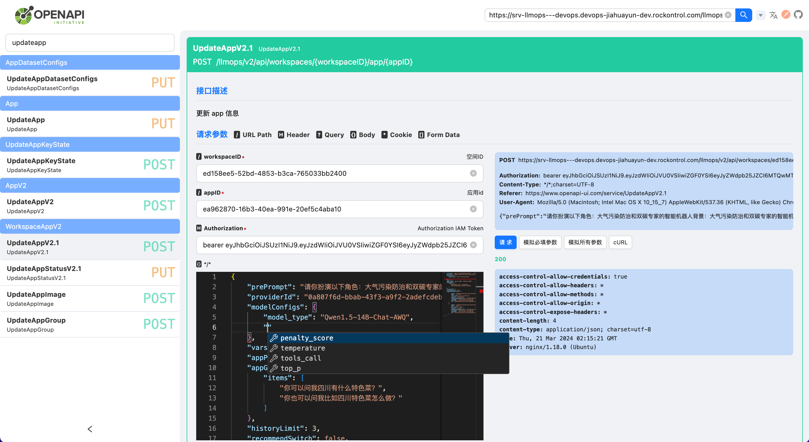
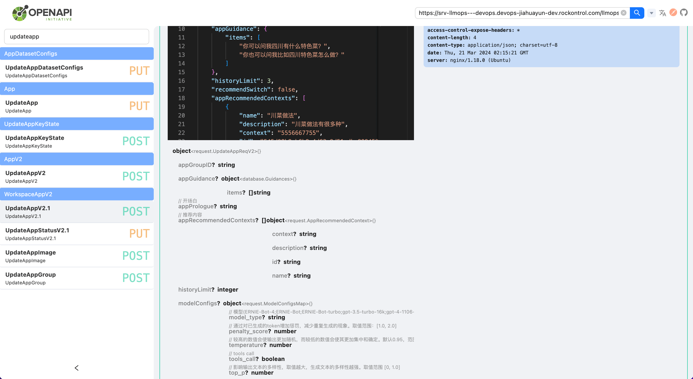
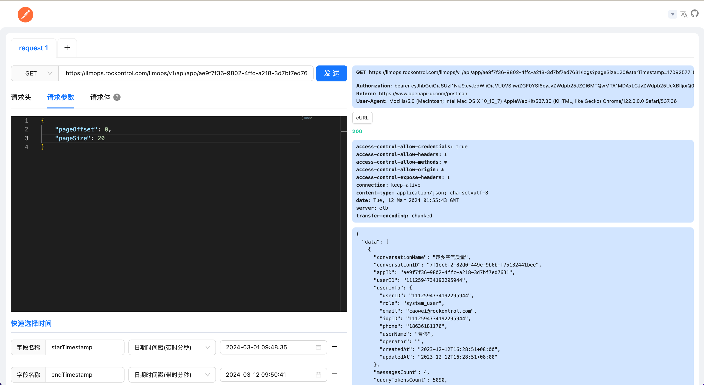

<h1 align="center">
  OpenAPI UI
</h1>
<p align="center">
比 Swagger-UI 更好用、更美观的 OpenAPI-UI 接口文档，可以快速的生成模拟请求参数并调用 API 请求，也是简化版的 postman 工具
</p>
<p align="center">
  <a href="https://github.com/rookie-luochao/openapi-ui/blob/master/LICENSE">
    
  </a>
  <a href="https://github.com/rookie-luochao/openapi-ui/releases">
    
  </a>
  <a href="https://www.npmjs.com/package/openapi-ui-dist">
    
  </a>
  <a href="https://github.com/rookie-luochao/openapi-ui/actions/workflows/release-ci.yml">
    
  </a>
  <a href="https://react.dev">
    
  </a>
</p>
<h4 align="center">
  <p>
    <a href="https://github.com/rookie-luochao/openapi-ui/blob/master/README.md">English</a> |
    <b>简体中文</b>
  </p>
</h4>

## 截图
<div style="display:flex">
  <a href="https://github.com/rookie-luochao/openapi-ui/blob/master/src/assets/screen-shot/openapi-view.png" style="width:50%">
    
  </a>
  <a href="https://github.com/rookie-luochao/openapi-ui/blob/master/src/assets/screen-shot/openapi-view2.png" style="width:50%">
    
  </a>
</div>
<a href="https://github.com/rookie-luochao/openapi-ui/blob/master/src/assets/screen-shot/postman-view.png">
  
</a>

## 网站域名
* CN: [www.openapi-ui.com](https://www.openapi-ui.com)，支持http、https
* US: [doc.openapi-ui.com](https://doc.openapi-ui.com)
* US2: [docs.openapi-ui.com](https://docs.openapi-ui.com)

## 使用方法
### CDN接入
`spec-url` 为 `完整路径`

```tsx
<!doctype html>
<html lang="en">
  <head>
    <meta charset="UTF-8" />
    <title>openAPI UI</title>
  </head>
  <body>
    <div id="openapi-ui-container" spec-url="https://petstore3.swagger.io/api/v3/openapi.json" theme="light"></div>
    <script src="https://cdn.jsdelivr.net/npm/openapi-ui-dist@latest/lib/openapi-ui.umd.js"></script>
  </body>
</html>
```

`spec-url` 为 `路径`

```tsx
<!doctype html>
<html lang="en">
  <head>
    <meta charset="UTF-8" />
    <title>openAPI UI</title>
  </head>
  <body>
    <div id="openapi-ui-container" spec-url="/openapi.json" theme="dark"></div>
    <script src="https://cdn.jsdelivr.net/npm/openapi-ui-dist@latest/lib/openapi-ui.umd.js"></script>
  </body>
</html>
```

### React接入(或者 Vue接入)
```tsx
import { useEffect } from "react";

const SetUpOpenApiUI = () => {
  useEffect(() => {
    import("openapi-ui-dist")
  }, []);

  return (
    <div id="openapi-ui-container" spec-url="https://petstore3.swagger.io/api/v3/openapi.json" theme="light" />
  );
}

export const openapiRoutes = {
  path: "/openapi",
  id: "openapi",
  element: <SetUpOpenApiUI />,
};
```
### Golang后端框架接入
- [go-openapi-ui](https://github.com/rookie-luochao/go-openapi-ui)

### Nodejs后端框架接入
- [nodejs-openapi-ui](https://github.com/openapi-ui/nodejs-openapi-ui)

## 快速开始
```bash
# node version >= 18
# 下载依赖包
pnpm install
# or make install

# 启动
npm run dev
# or make dev
```

## 其他命令
```bash
# 打包构建
npm run build
# or make build

# 生成docker镜像
make docker-build

# 运行docker镜像
make docker-run

# 生成docker镜像，并且运行docker镜像
make docker-build-run
```

## 支持的数据格式
* swagger2.json/swagger2.yml
* openapi3.json/openapi3.yml

## 使用方法
* 输入 swagger2/openapi3 的网关地址, 重新刷新页面就可以更新接口
* 上传 swagger2/openapi3 文件
* 输入 swagger2/openapi3 文本

## 全局配置
* 支持配置接口请求超时时间，默认的接口请求超时时间为 2 分钟
* 支持配置接口请求Authorization，可以在当前接口覆写Authorization

## 分享URL
* 只有通过 url 模式导入才可以分享链接
* 拷贝链接分享给需要的人，他们可以通过 url 回显到指定接口

## 模拟接口请求数据
1. 如果 openapi 接口请求参数 schema 定义了 format 字段，则使用 [openapi-sampler](https://github.com/Redocly/openapi-sampler) 去生成模拟请求参数
2. 如果 openapi 接口请求参数 schema 没有定义 format 字段, 则使用 faker 去生成模拟请求参数

## 接口请求错误信息展示规则
1. 如果返回的结构体含有 message 字段，则展示 message 字段
2. 如果返回的结构体含有 msg 字段，则展示 msg 字段
3. 如果返回的结果是字符串，则展示字符串
4. 展示 AxiosResponse.statusText 类型对应的字段
5. 展示 AxiosError.message 类型对应的字段

## 连接内网api
* 如果不能连接内网api, 你可以在本地运行此项目或者使用 docker 在本地或者服务器部署此项目

## 同时查看多个api网关
* 默认的缓存策略是session storage, 可以同时打开多个页面去查看多个 api 网关

## Docker部署，支持环境变量注入
```bash
# 拉取 Docker 镜像
docker pull ghcr.io/rookie-luochao/openapi-ui:latest

# 启动容器，nginx反向代理可自定义端口，例如：docker run -d -p 8081:80 ghcr.io/rookie-luochao/openapi-ui:latest
docker run -d -p 80:80 -e APP_CONFIG=env=zh,appNameZH=简洁美观的接口文档 ghcr.io/rookie-luochao/openapi-ui:latest
```

## node版本
node >= 18